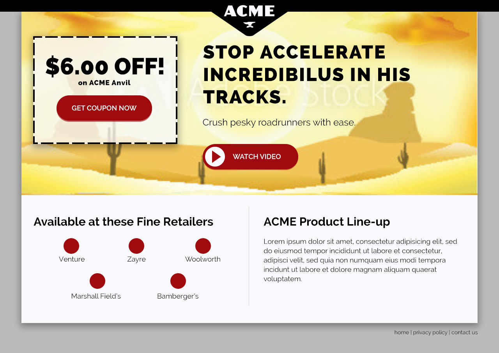

# 03 Front-end Track - Phase 2 [FINAL DRAFT]

> Based on the requirements, your role in this is that of a front-end developer. Another developer is handling the backend interface for client to make edits. Your primary objective as this type of developer will be to build out a prototype as well as handle any of the front-end styling and functionality that is required of the project.


## Objective
Client would like to move forward with this approach. Now we need to get this styled to match brand look and feel. Because this is going to eventually be in a production environment and we're going to customize the styles, we don't necessarily want to be referencing the CDN for the front-end resources. Beyond customizing Bootstrap and match brand styles, this will also get you acquainted with using build tools and front-end package managers.


## Setup
There are a few package managers that will need to be installed first in order to pull some of dependencies we'll be using for the project.

### Node.js
Make sure `node.js` is installed. You can get it [here](https://nodejs.org/en/download/).

Install `bower` and `gulp`. You can read about what these do in the resources below. Once you install these globally (`-g`) the first time, you won't need to do this again.

```
npm install -g bower
npm install -g gulp
```

Initialize `npm`:

```
npm init
```

`Enter` through the default prompts. A `package.json` file is created in the root. This is the configuration for this project for npm.

We're also going to install gulp locally into the project.

```
npm install --save-dev gulp
```

This will create a `node_modules` directory in the root of the project. Anything that node requires for the project will go in this directory. It will also mark gulp as a dependency in `package.json` due to the `--save-dev` flag in the command.

If you don't have a `.gitignore` file, create one now and add `node_modules` to it.


### Bower
In the root of your project, create a `.bowerrc` file.

Add this to the file:

```
{
	"directory" : "src/vendor"
}
```

This will tell bower where you want to put all your dependencies. By default it will throw it in a folder `bower_components`. We override this because we'll end up using the `src` directory for our authoring less and js files. This will just keep everything together.

Let's configure bower. Run... 

```
bower init
```

You can use the defaults for all the prompts. This sets up bower's configuration for this project, the output being a `bower.js` file.

Pull in Bootstrap. 

```
bower install bootstrap --save
```

It puts these dependencies in `src/vendor`. You'll see that `jquery` is there too. This is because it is a dependency for Bootstrap. It also added Bootstrap as a dependency in `bower.js` thanks to `--save`.

In your `src` directory, create directories for `less` and `js`. This is where your authoring files should go.

Add `/src/vendor` to your `.gitignore`.

> **NOTE:** This should get you to "zero" in order to start actually creating for the project. Again, some of these steps are one-time things. Others, you'll do at the start of any project. 

## Activities
The following Activities will require some research into `gulp` and `less`. This list outlines the activities. The resources are below.

- Create your own LESS file that imports bootstrap.
- Use Gulp to compile your LESS into a file at `assets/css/site.css`
- Use Gulp to compile your javascript into a file at `assets/js/site.js`
- Update your code to use these new files instead of the CDN values.
- Add additional classes to markup to target specific brand customizations.
- Match the provided comp as closely as possible (comp coming soon...)

## Resources

- [https://nodejs.org/en/download/](https://nodejs.org/en/download/)
- [http://bower.io/](http://bower.io/)
- [http://lesscss.org/](http://lesscss.org/)
- [http://gulpjs.com/](http://gulpjs.com/)
- [https://github.com/gulpjs/gulp/blob/master/docs/getting-started.md](https://github.com/gulpjs/gulp/blob/master/docs/getting-started.md)

## Skills Learned

Using pre-compilers and task managers - Bower/LESS/Gulp, working with fonts, Photoshop, and more advanced styling to match design comp.

## Assets

This layout uses the font `Raleway`. It can be found on GoogleFonts. The brand colors are `#9e0b0f` and `#fdf080`. Use them as you see fit.
Please find the reseller logos and get them in there.


