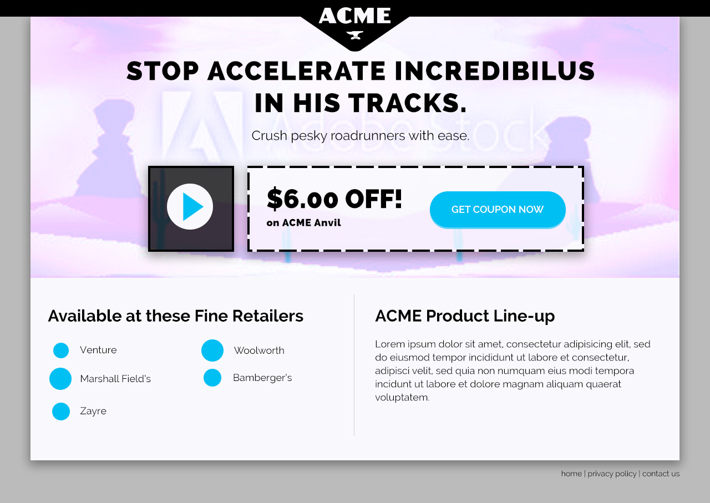

# 03 Front-end Track - Phase 3

> Based on the requirements, your role in this is that of a front-end developer. Another developer is handling the backend interface for client to make edits. Your primary objective as this type of developer will be to build out a prototype as well as handle any of the front-end styling and functionality that is required of the project.


## Objective
Client would like to open this up to other products. Each product will have its own look and feel. Client would also like a layout variation option.

## Activities
Build this to support 3 different color themes. A theme will consist of a primary color, headline font, and body font. All buttons should be the primary color.

### Themes

**Anvil**
* color: `#981b1e` 
* headline: `Raleway` 
* body `Raleway`

**Glue** 
* color: `#B7AF1F` 
* headline: `Oswald` 
* body `Helvetica`

**Jet Propelled Unicycle** 
* color: `#DCA65A` 
* headline: `Roboto Slab` 
* body `Helvetica`

### Page Variables
Assume there will be a collection of variables made available for the page. Use these to get the appropriate output for the brand. The values, separated by pipes `|` are the possible values for that particular variable.

* `$code` (string) anvil | glue | jet_propelled_unicycle
* `$headline` (string) 
* `$content` (string/html)
* `$layout` (string) default | centered
* `$theme` (array) 
    * `hex` (string) #981b1e | #B7AF1F | #DCA65A
    * `color` (string) red | green | blue
    * `headline` (string) raleway | oswald | roboto_slab
    * `body` (string) raleway | helvetica

One approach might be to prefix some of these values to the `body` (or another wrapping container) and write specific classes to appropriately get the correct theme look. 

```
<body class="brand-<?= $code ?> layout-<?= $layout ?>">
```

or

``` 
<body class="theme-color-<?= $theme['color'] ?> theme-body-<?= $theme['body'] ...">
```

> **NOTE:** It's worth noting that you might not always know the exact variable values so the goal might be to not rely too heavily on known values and build it in a way to allow for greatest flexibility. This approach would mean that the stylesheet also "knows" about all possible values.

Another option would be to output a style block that has dynamic values right into the head of the body. Either way, there are a number of ways to accomplish this. 

```
// in the <head>
<style>
    .brand-headline { font: <?= $theme['headline']?>; }
    ...
</style>


// in the layout...

<h1 class="brand-headline"><?= $headline ?></h1>
```

There are a number of ways to accomplish this. Technically you could even have your Gulp file pull variables from other places in order to get multiple stylesheet output and then have the page pull the appropriate one. Just remember the goal is to make this flexible to handle more brands with a dynamic set of options.

 
 Make this so that way we can change out variable values and the result responds appropriately to the correct layout and theme. Use PHP `include` to pull in markup that is usable in multiple layouts so you don't have to duplicate code.

## Skills learned
More flexible css/less structure, PHP variables, writing conditions, view logic, and using php includes.

## Assets

