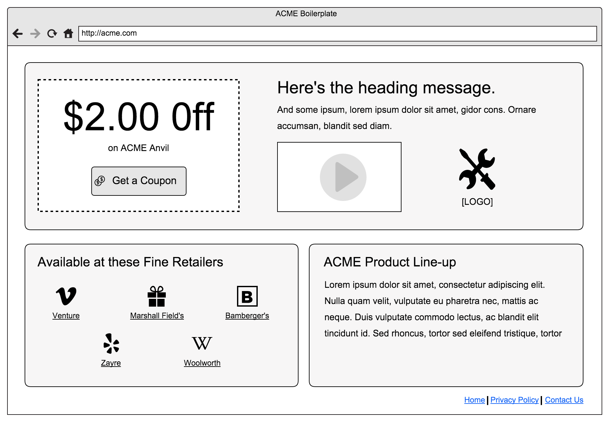

# 03 Front-end Track

## Overview
Based on the requirements, your role in this is that of a front-end developer. Another developer is handling the backend interface for client to make edits. Your primary objective as this type of developer will be to build out a prototype as well as handle any of the front-end styling and functionality that is required of the project.

## Phase 1

### Objective
Client would like to see proof-of-concept before going "all-in" on a design. Our approach will be to build a functional prototype to have client approve the idea and so they can see how it will display on multiple viewports. This will be a functional wireframe. Widths in the wireframe are approximate, default to the nearest grid size per the css framework.

### Activities

- Start by creating an `index.html` file.
- Using the wireframe provided, build out a static page scaffolding with default Bootstrap look and feel.
- Add custom styling throughout to match the wireframe where appropriate. Any custom styles should either be in a style tag in the header or put in an external css file.
- Use the bootstrap and jQuery CDN to reference the css and javascript files.
- Use placeholders for any images (logos, video poster, etc)
- Links should go to “#” or “javascript:void(0);"
- Make the video play in a modal when the button is clicked.
- Assume the video will be a youbtube or vimeo link.
- Needs to respond appropriately to any screen size.

### Best Practices

- All images should utilize `alt` tags.
- Add all css assets in the `<head>` tags.
- Add all javascript before the closing `<body>` tag.
- Add the `meta viewport` tag

### Resources
- [https://www.bootstrapcdn.com/](https://www.bootstrapcdn.com/)
- [https://code.jquery.com/](https://code.jquery.com/)
- [http://getbootstrap.com/](http://getbootstrap.com/)
- [https://placehold.it/](https://placehold.it/)

### Skills learned
Exercise skills using html, css, js, and existing template frameworks.

### Assets

===

## Phase 2

*[Forming Requirements]*

### Objective
Client would like to move forward with this approach. Now we need to get this styled to match branch look and feel.

### Activities

- Modify default look and feel to match defined brand (comp) and custom theme work.
- Use bower to pull in the bootstrap framework.
- Create your own LESS file that imports bootstrap.
- Use Gulp to compile your LESS into a file called app.css, in an `assets/css` directory
- Use Gulp to compile your javascript into a file called app.js, in an `assets/js` directory
- Add additional classes to markup to target specific brand customizations.

### Best Practices

### Resources

- [http://bower.io/](http://bower.io/)
- [http://lesscss.org/](http://lesscss.org/)
- [http://gulpjs.com/](http://gulpjs.com/)
- [https://github.com/gulpjs/gulp/blob/master/docs/getting-started.md](https://github.com/gulpjs/gulp/blob/master/docs/getting-started.md)

### Skills Learned

Using pre-compilers and task managers - bower/LESS/Gulp. More advanced styling to match design comp.

### Assets

[brand comp coming soon...]

===

## Phase 3

*[Forming Requirements]*

### Objective
Client would like to open this up to other products. Each product will have its own look and feel but the layout should remain consistent.

### Activities
- Create flexible theme with color options
- more complex layout modifiers.

### Skills learned
Using more sophisticated build tools and advanced functionality - Gulp/JS.